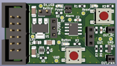
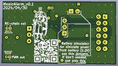

# Music alarm:  
Playing music (sound signals) when the signal line breaks.  

### Schemes:  
###### Music_alarm_v0.1:  
[pdf](docs/music_alarm_v0.1.pdf)  

### Images:  
###### Music_alarm_v0.1:  
top:  
  
bottom:  
  

###### gerber:  
Archive for production:  
[Music_alarm_v0.1](https://github.com/piro-s/music_amplifier/raw/main/gerber/music_amplifier_v0.1.zip)  